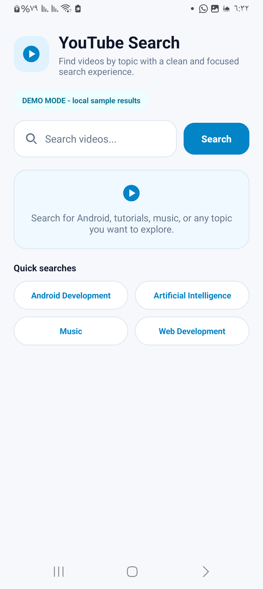
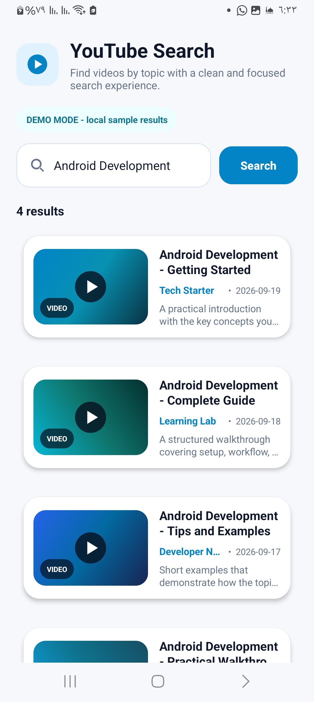

# YouTube Search App

A lightweight Android application built with Java that searches YouTube videos using the YouTube Data API v3 and presents results in a clean, modern mobile interface.

When no API key is configured, the app automatically switches to a clearly labeled local Demo Mode so the interface and search flow can still be explored without external credentials.

## Screenshots

<table>
  <tr>
    <td align="center">
      
      <br>
      <strong>Home</strong>
    </td>
    <td align="center">
      
      <br>
      <strong>Search Results</strong>
    </td>
  </tr>
</table>

## Features

- Search YouTube videos by keyword when YouTube Data API credentials are configured.
- Automatic local Demo Mode when no API key is available.
- Modern light/dark interface with a cyan and blue visual theme.
- Quick-search suggestions for common topics.
- Display results in a RecyclerView with responsive CardView-based items.
- Show video title, channel, publish date, description, and thumbnail.
- Load live YouTube thumbnails with Glide.
- Display local demo thumbnails in Demo Mode.
- Open a selected live result directly in YouTube.
- Handle empty input, missing connectivity, no-result states, and API errors.

## Tech Stack

- Java
- Android SDK
- RecyclerView
- CardView
- Glide
- HttpURLConnection
- YouTube Data API v3
- Gradle

## Demo Mode

Demo Mode is enabled automatically when `YOUTUBE_API_KEY` is empty.

It uses local sample results and bundled thumbnails so the full user interface can be demonstrated without external API credentials. Demo results are clearly labeled in the application and are not presented as live YouTube data.

When a valid API key is configured, the app uses the YouTube Data API v3 instead.

## Requirements

- JDK 21 recommended for the current Gradle setup
- Android SDK Platform 36
- Android SDK Build Tools
- A YouTube Data API v3 key only if live search is required

## Setup

1. Clone the repository:

   ```bash
   git clone https://github.com/Mohamed-Issam-1/YouTubeSearchApp.git
   cd YouTubeSearchApp
   ```

2. Create a `local.properties` file in the project root. You can use `local.properties.example` as a reference.

3. Add your Android SDK path:

   ```properties
   sdk.dir=C:/Users/YourName/AppData/Local/Android/Sdk
   ```

4. To enable live YouTube search, also add:

   ```properties
   YOUTUBE_API_KEY=YOUR_API_KEY
   ```

   Leave `YOUTUBE_API_KEY` empty to use Demo Mode.

5. Keep `local.properties` out of version control. If you use an API key, restrict it appropriately in Google Cloud.

6. Build the debug APK:

   ```powershell
   .\gradlew.bat clean assembleDebug
   ```

7. The generated APK will be available at:

   ```text
   app/build/outputs/apk/debug/app-debug.apk
   ```

## Project Structure

```text
app/src/main/
|-- java/com/example/youtubesearchapp/
|   |-- MainActivity.java
|   |-- NetworkUtils.java
|   |-- VideoAdapter.java
|   `-- VideoItem.java
|
`-- res/
    |-- layout/
    |   |-- activity_main.xml
    |   `-- item_video.xml
    |-- drawable/
    `-- values/

docs/
`-- screenshots/
    |-- home.png
    `-- search-results.png
```

## Security

The YouTube API key is read from the local `local.properties` file and is not stored in the Git repository.

API keys embedded in Android applications can still be extracted from a built APK, so API restrictions should always be configured for any production credential.

## Technical Note

The current implementation retains `AsyncTask` from the original Java implementation. `AsyncTask` is deprecated in modern Android development; a future refactor could replace it with a current background-execution approach.

## Status

Completed.
